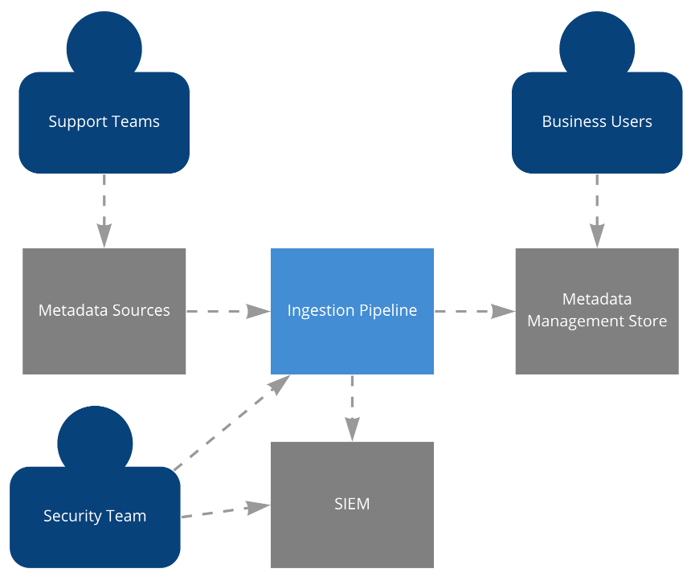

<h1 align="center">
  <a></a>
</h1>

<h4 align="center">A minimal Metadata Ingestion Framework inspired by datahubproject.io</a></h4>

<p align="center">
  <a href="#deploy-to-azure">Deploy</a> •
  <a href="#ingest-metadata">Ingest</a> •
  <a href="#architecture">Architecture</a> •
  <a href="#todo">To Do</a> 
  <a href="#links">Links</a> •
</p>

This framework is based on the DataHub ingestion architecture which _"supports an extremely flexible ingestion architecture that can support push, pull, asynchronous and synchronous models"_. For the time being, this Framework only supports aynchrounous communication. 

For a deep dive into metadata ingestion architectures, check out [this](https://engineering.linkedin.com/blog/2020/datahub-popular-metadata-architectures-explained) awesome artice by Shirshanka Das from Linkedin.

## Deploy to Azure

**Prerequisites:**
- Azure subscription with `Contributor` access.
- Latest version of [Terraform](https://www.terraform.io/downloads.html) (getting started guide [here](https://learn.hashicorp.com/tutorials/terraform/install-cli?in=terraform/azure-get-started))

⚠️ The schema module introduces dependencies on Bash and Curl. Windows users may need to use WSL or Docker. This will be resolved when the Terraform AzureRM provider introduces support for the Azure Schema Registry ⚠️


```bash
az login
terraform init
terraform apply
```


## Ingest Metadata
Developers are encouraged to write plugins to integrate with various data sources. The `plugins/example` directory contains example code that can be used as a starting point for writing a plugin. This example follows the [sidecar](https://docs.microsoft.com/en-us/azure/architecture/patterns/sidecar) pattern.

At a high level, a plugin is reponsible for:
- Capturing metadata changes
- Modelling the metadata using the Schema Registry
- Emitting mettadata events

**To get started:**
- Install Docker
- Install Az CLI

Next, run the following snippet. The example code will send a mock Metadata Event to the Metaverse api.

Execution is succesful when `MCE Published` is printed to the console. 

```bash
az login
export CONNECTION_STRING=$(az eventhubs \
    namespace authorization-rule keys list \
    --resource-group rg-metaverse-resources \
    --namespace-name ehns-metaverse \
    --name RootManageSharedAccessKey \
    --query primaryConnectionString \
    --out tsv)

export EVENTHUB=eh-metaverse

docker run -it \
    --env CONNECTION_STRING="$CONNECTION_STRING" \
    --env RESOURCE_GORUP="$RESOURCE_GORUP" \
    $(docker build -q .)
```

# Architecture

The below diagram best illistrates how the framework operates. The left side shows how the internal components interact, the right is how a Metadata Management system might consume and produce metadata events. 


1. Metadata producers retrieve a schema from the Schema Service. 
This serves as a contract which allows both producing an consuming applications to evolve independently. 
2. Metadata producers emit metrics which are serialised using this shared schema. These events recieved by the Event Streaming service.
3. Matadata events are persisted to the Object Storage service where they are retained indefinately.

### Context Diagram
The context diagram shows how this system fits into the world around it. See [c4model.com](https://c4model.com/)



## Architecture Decisions
The `docs/architecture` directory contains lightweight architecture decision records (ADR). The understand ADRs, see [this](https://cognitect.com/blog/2011/11/15/documenting-architecture-decisions) blog post. 

For examples, check out [this](https://github.com/alphagov/govuk-aws/tree/master/docs/architecture/decisions) repo. 

## Todo
- [x] Create infrastructure code for Eventhub and Datalake
- [x] Getting started guide for infrastructure developers
- [x] Create a single infrastructure test to be used as a reference
- [x] Create sample code for metadata producers
- [x] Document Schema Registry creation
- [x] Automate Schema Registry creation
- [x] Create infrastructure test for Schema Registry
- [ ] Document infrastructure testing
- [ ] Apply data governanace and security controls for Datalake
- [ ] Apply security permissions for services
- [ ] Apply security permissions for users
- [ ] Export resource manager audit logs to Log Analytics

## Links
https://engineering.linkedin.com/blog/2020/datahub-popular-metadata-architectures-explained
https://cognitect.com/blog/2011/11/15/documenting-architecture-decisions
https://martinfowler.com/eaaDev/EventSourcing.html
https://martinfowler.com/articles/platform-prerequisites.html
https://github.com/alphagov/govuk-aws/tree/master/docs/architecture/decisions


